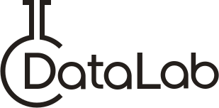

Applications and Projects using OSHI
-------------------
<table style="padding:6px"><tr>
    <td align=center width=134px><a href="https://www.atlassian.com/software/confluence"> Atlassian Confluence</a></td>
    <td align=center width=134px><a href="https://apereo.github.io/cas">  CAS Server</a></td>
    <td align=center width=134px><a href="https://docs.geoserver.org/stable/en/user/community/status-monitoring/index.html"> GeoServer</a></td>
    <td align=center width=134px><a href="https://flink.apache.org/"> Apache Flink</a></td>
    <td align=center width=134px><a href="https://deeplearning4j.org/"> DeepLearning4J</a></td>
    <td align=center width=134px><a href="https://kamon.io/"> Kamon System Metrics</a></td>
  </tr><tr></tr><tr>
    <td align=center width=134px><a href="https://github.com/nosqlbench/nosqlbench"> NoSQLbench</a></td>
    <td align=center width=134px><a href="https://octopus.com/"> Octopus Deploy</a></td>
    <td align=center width=134px><a href="https://karaf.apache.org/"> Apache Karaf</a></td>
    <td align=center width=134px><a href="https://github.com/UniversalMediaServer/UniversalMediaServer"> Universal Media Server</a></td>
    <td align=center width=134px><a href="https://github.com/psi-probe/psi-probe"> PSI Probe</a></td>
    <td align=center width=134px><a href="https://jppf.org/">    JPPF</a></td>
  </tr><tr></tr><tr>
    <td align=center width=134px><a href="https://www.minecraft.net"> Minecraft: Java Edition</a></td>
    <td align=center width=134px><a href="https://konduit.ai/"> Konduit</a></td>
    <td align=center width=134px><a href="https://www.appdynamics.com/"> AppDynamics</a></td>
    <td align=center width=134px><a href="https://www.hivemq.com/"> HiveMQ</a></td>
    <td align=center width=134px><a href="https://mosip.io/"> MOSIP</a></td>
    <td align=center width=134px><a href="https://www.handle.net/">    Handle.net</a></td>
  </tr><tr></tr><tr>
    <td align=center width=134px><a href="https://trino.io/">Trino DB</a></td>
    <td align=center width=134px><a href="https://github.com/tianshiyeben/wgcloud"> WGCLOUD</a></td>
    <td align=center width=134px><a href="https://github.com/tywo45/t-io"> t-io</a></td>
    <td align=center width=134px><a href="https://github.com/apache/incubator-datalab">   Apache DataLab</a></td>
    <td align=center width=134px><a href="https://cryptolens.io/"> Cryptolens</a></td>
    <td align=center width=134px><a href="https://github.com/hiparker/opsli-boot"> OPSLI</a></td>
  </tr><tr></tr><tr>
    <td align=center width=134px><a href="https://xap.github.io/">  GigaSpaces XAP</a></td>
    <td align=center width=134px><a href="https://github.com/openhab/openhab-addons/tree/main/bundles/org.openhab.binding.systeminfo"> OpenHAB Systeminfo Binding</a></td>
    <td align=center width=134px><a href="https://wiki.jenkins.io/display/JENKINS/Swarm+Plugin"> Jenkins Swarm Plugin</a></td>
    <td align=center width=134px><a href="https://ibm-watson-iot.github.io/iot-java/"> IBM Watson IoT Platform</a></td>
    <td align=center width=134px><a href="https://github.com/fulcrumgenomics/dagr"> DAGR</a></td>
    <td align=center width=134px><a href="https://dolphinscheduler.apache.org/"> Apache Dolphin Scheduler</a></td>
  </tr><tr></tr><tr>
    <td align=center width=134px><a href="https://github.com/hawkular/hawkular-agent"> Hawkular Agent</a></td>
    <td align=center width=134px><a href="https://dynamiasoluciones.com/"> DynamiaModules SaaS Remote</a></td>
    <td align=center width=134px><a href="https://doris.incubator.apache.org/"> Apache Doris</a></td>
    <td align=center width=134px><a href="https://www.semux.org/"> Semux</a></td>
    <td align=center width=134px><a href="https://github.com/stylefeng/Guns"> Guns</a></td>
    <td align=center width=134px><a href="https://github.com/Tencent/bk-ci"> BlueKing CI</a></td>
  </tr><tr></tr><tr>
    <td align=center width=134px><a href="https://nsquared.co.nz/files/n2jslee/technical_guide/"> N-Squared Java SLEE</a></td>
    <td align=center width=134px><a href="https://developer.envisioniot.com/"> EnOS IoT Hub</a></td>
    <td align=center width=134px><a href="https://www.fastchar.com/fc_lib/13"> FastChar-ExtJs</a></td>
    <td align=center width=134px><a href="https://github.com/criteo/garmadon">    Garmadon</a></td>
    <td align=center width=134px><a href="https://www.hutool.cn/">    Hutool</a></td>
    <td align=center width=134px><a href="https://github.com/fizzed/crux">  Crux Utilities</a></td>
  </tr><tr></tr><tr>
    <td align=center width=134px><a href="https://app.rossonet.net/"> AR4K Edge Agent</a></td>
    <td align=center width=134px><a href="https://www.nexess-solutions.com/fr/produits/application-nexcap-mat/"> NexCap MAT</a></td>
    <td align=center width=134px><a href="https://360suite.io/">   SAP 360Suite</a></td>
    <td align=center width=134px><a href="https://github.com/gomint/gomint">  GoMint</a></td>
    <td align=center width=134px><a href="https://www.ruoyi.vip/"> RuoYi Management System</a></td>
    <td align=center width=134px><a href="https://github.com/WeiYe-Jing/datax-web"> DataX Web</a></td>
  </tr><tr></tr><tr>
    <td align=center width=134px><a href="https://lightstep.com/"> Lightstep</a></td>
    <td align=center width=134px><a href="https://www.gocypher.com/gocypher/"> GoCypher</a></td>
    <td align=center width=134px><a href="https://javahost.org"> JavaHost.org monitoring pane</a></td>
    <td align=center width=134px><a href="https://axway.github.io/ats-framework/ATS-Documentation.html"> Axway ATS Agent</a></td>
    <td align=center width=134px><a href="https://github.com/CloudSlang/score"> CloudSlang Score</a></td>
    <td align=center width=134px><a href="https://github.com/erupts/erupt"> Erupt Framework</a></td>
  </tr><tr></tr><tr>
    <td align=center width=134px><a href="https://www.starrocks.com/en-US/index">StarRocks</a></td>
    <td align=center width=134px><a href="https://www.graylog.org/">    Graylog</a></td>
    <td align=center width=134px><a href="https://vaadin.com/">    Vaadin Platform</a></td>
    <td align=center width=134px><a href="https://docs.habit.io/"> Habit Analytics</a></td>
    <td align=center width=134px><a href="http://www.ridkorfid.com/">    Ridko Notify</a></td>
    <td align=center width=134px><a href="https://github.com/Krillsson/sys-API"> sys-API</a></td>
  </tr><tr></tr><tr>
    <td align=center width=134px><a href="https://biop.github.io/ijp-imagetoatlas/"> BioImaging And Optics Platform</a></td>
    <td align=center width=134px><a href="https://www.alluxio.io/"> Alluxio</a></td>
    <td align=center width=134px><a href="https://github.com/MattFLying/PC-Details">    PC-Details</a></td>
    <td align=center width=134px><a href="https://github.com/paremus/ui_server">  Paremus UI Server</a></td>
    <td align=center width=134px><a href="https://github.com/B-Software/Ward"> Ward</a></td>
    <td align=center width=134px><a href="https://github.com/rememberber/MooInfo"> MooInfo</a></td>
</tr></table>
